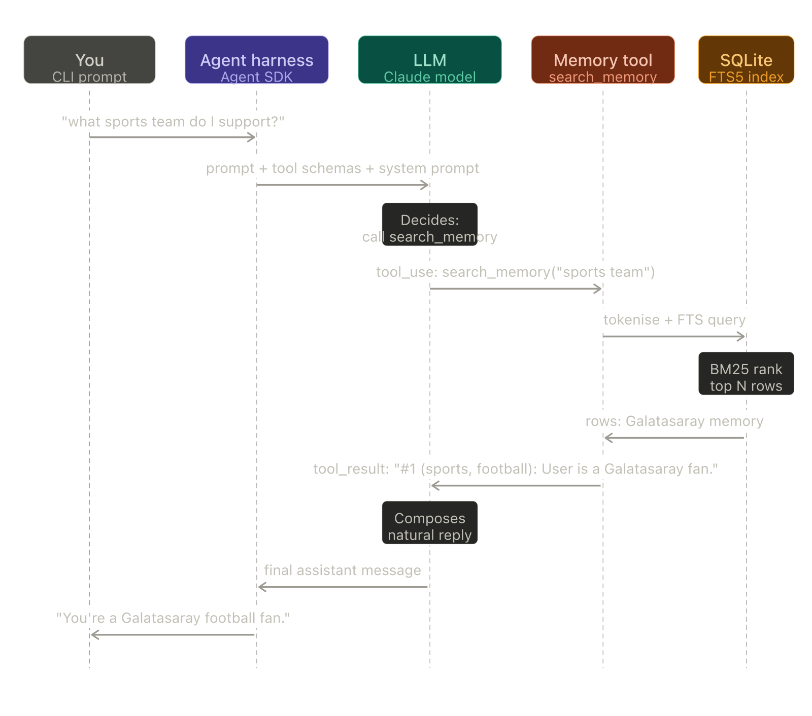

> **Note for publishing on Medium:** reuse the same hero image as [Part 1](https://medium.com/@bulentg/building-a-personal-ai-agent-part-1-hello-agent-a0c9e66036a0) so the series has visual continuity.

# Building a Personal AI Agent, Part 2: Memory

*Part 2 of a series where we build a personal AI agent from scratch in Node.js, one capability at a time. [Part 1](https://medium.com/@bulentg/building-a-personal-ai-agent-part-1-hello-agent-a0c9e66036a0) covered the basic agent loop with web search.*

---

## Where we left off

In Post 1 we had a 30-line agent that could chat with us and use web search. It worked, but it had the memory of a goldfish — every message a fresh start, every conversation lost the moment we hit Ctrl-C.

Today we fix that. By the end of this post the agent will:

- Remember things you tell it, across sessions, indefinitely
- Decide *on its own* when to save something worth remembering
- Search its memory before answering questions about you
- Tell you what you've been talking about lately

What we're explicitly *not* doing: vector databases, embeddings, semantic search, RAG pipelines. Save those for when you actually need them — which, for personal use, is much later than the tutorials suggest. We'll see why.

---

## The two questions everyone gets wrong

When someone says "AI agent with memory", most engineers immediately think:

1. **A vector database** (Pinecone, Chroma, Qdrant, pgvector…)
2. **Embeddings** (OpenAI's `text-embedding-3-small`, Voyage, BGE…)
3. **A retrieval pipeline** (chunk, embed, store, query-embed, cosine-similarity, top-k)

This is the standard advice and it's almost always wrong for personal agents. It's the answer to a different question — "how do I do semantic search over a million documents?" — applied to a problem that doesn't have a million documents.

The two questions I'd ask first are simpler.

**How much will the agent actually remember?** Personal use is, maybe, a few hundred memories over a year. Your preferences, ongoing projects, people you mention, decisions you've made. SQLite handles a few hundred rows in microseconds. We don't need a vector index.

**What does "memory" mean to the agent?** It's a *tool*. Not magic, not a hidden context window, not a retrieval pipeline running underneath. It's literally three functions the agent can choose to call: save, search, list. The agent decides when.

Once you frame it that way, the design becomes obvious. SQLite + a couple of indexes + good tool descriptions. Build that first. When (if) you actually outgrow it, you'll have data to inform the next step.

---

## The schema

One table, plus SQLite's built-in full-text search (FTS5):

```sql
CREATE TABLE memories (
  id          INTEGER PRIMARY KEY AUTOINCREMENT,
  text        TEXT NOT NULL,
  tags        TEXT NOT NULL DEFAULT '[]',  -- JSON array as string
  created_at  TEXT NOT NULL DEFAULT (datetime('now'))
);

CREATE VIRTUAL TABLE memories_fts USING fts5(
  text, tags,
  content='memories',
  content_rowid='id',
  tokenize='porter unicode61'
);
```

Three triggers keep the FTS index in sync with the base table on insert/update/delete (full SQL is in the repo).

**Why FTS5 and not `LIKE '%coffee%'`?** Three reasons. *Tokenisation* — FTS5 splits on word boundaries and is case-insensitive out of the box. `LIKE` requires you to lowercase everything yourself. *Stemming* — with the `porter` tokeniser, "running" and "runs" both match a search for "run". Not perfect but surprisingly good. *Ranking* — FTS5 uses BM25 for relevance scoring. `LIKE` has no concept of "more relevant".

**A small gotcha worth pointing out.** FTS5 has two very different query modes. Wrap the whole query in double quotes (`"sports team"`) and it does a *phrase match* — every term must appear together in that exact order. Pass the terms separated by `OR` (`"sports" OR "team"`) and it does a *term match* — any of these words is enough, and BM25 ranks results by how well they match.

For an agent that searches with natural-language queries like "what sports team do I support?", phrase matching almost always returns nothing. The query terms rarely appear contiguously in the original memory. So before sending anything to FTS5, we tokenise: split the query into words, drop punctuation and one-letter noise, quote each term individually, and `OR` them together:

```typescript
export function searchMemories(query: string, limit = 5): Memory[] {
  const terms = query
    .toLowerCase()
    .replace(/[^a-z0-9\s]/g, " ")
    .split(/\s+/)
    .filter((t) => t.length >= 2)
    .map((t) => `"${t}"`);

  if (terms.length === 0) return [];

  const ftsQuery = terms.join(" OR ");

  const stmt = db.prepare(`
    SELECT m.id, m.text, m.tags, m.created_at
    FROM memories_fts f
    JOIN memories m ON m.id = f.rowid
    WHERE memories_fts MATCH ?
    ORDER BY rank
    LIMIT ?
  `);

  try {
    const rows = stmt.all(ftsQuery, limit) as Row[];
    return rows.map(rowToMemory);
  } catch {
    return [];
  }
}
```

Quoting each term means any FTS5 syntax characters left over (asterisks, carets) are treated as literals rather than operators — so the agent can pass whatever query it likes without us teaching it FTS5 syntax. The `ORDER BY rank` does the heavy lifting: even though every result *could* match, BM25 surfaces the ones that match best.

**Why not jump to `sqlite-vec` for embeddings?** Because we don't have a problem yet. Premature optimisation looks the same whether the optimisation is a B-tree or a vector index. We'll know we need embeddings when keyword search demonstrably fails us — for example, when "what's my fave hot drink?" doesn't find the memory "user loves Earl Grey tea". That's when embeddings earn their keep. Until then, they're complexity for its own sake.

---

## The three tools

Here's where the agent meets the database. We expose three tools via the SDK's `tool()` helper:

**`save_memory`** — inserts a new memory with optional tags. The agent calls this when the user shares something worth remembering across conversations.

**`search_memory`** — keyword search via FTS5. The agent calls this before answering questions about the user.

**`list_recent_memories`** — last N memories by date. Useful for "what have we talked about lately?" or for the agent to check which tags exist before saving a new one.

The tool definition itself is straightforward — Zod schemas for inputs, an async handler for the logic. But the most important part isn't the code, it's the *descriptions*. Here's `save_memory`:

```typescript
const saveMemoryTool = tool(
  "save_memory",
  "Save a piece of information to long-term memory. Use this when the user " +
    "tells you something worth remembering across conversations — preferences, " +
    "facts about them, decisions, ongoing projects, recurring people. " +
    "Don't save trivia from search results or things you can easily look up again. " +
    "If unsure, prefer saving — small over-recall is better than forgetting.",
  {
    text: z.string().min(1).describe(
      "The memory itself, written as a complete self-contained sentence. " +
      "Good: 'User prefers tea over coffee, especially Earl Grey.' " +
      "Bad: 'tea' (too short, no context when retrieved later)."
    ),
    tags: z.array(z.string()).default([]).describe(
      "Short lowercase keywords for categorisation, e.g. ['preferences', 'food']. " +
      "Reuse existing tags when possible — check list_recent_memories first if unsure."
    ),
  },
  async ({ text, tags }) => { /* ... */ },
);
```

**The descriptions are prompt engineering.** That text isn't documentation for me — it's instructions for the model. Every word in there is doing work.

"preferences, facts about them, decisions, ongoing projects, recurring people" — specific categories give the model anchors. Vague descriptions ("save important stuff") produce vague decisions. "Don't save trivia from search results" — without this, the agent will eagerly save the weather every time you ask about it. "If unsure, prefer saving — small over-recall is better than forgetting" is a *bias instruction*, telling the agent which way to err. Models follow these surprisingly well. And the "Good: ... Bad: ..." examples in the parameter description give the model concrete anchors. Concrete examples beat abstract rules.

Try shipping a version without these descriptions and watch the difference. It's the single biggest lever in this whole post.

---

## What actually happens when the agent recalls

Before we wire the tools into the agent, here's the full flow when you ask "what sports team do I support?" and the agent retrieves the answer from memory:



Five participants. The user types into the CLI. The agent harness (the SDK's `query()` function) packages the prompt with the tool schemas and system prompt and sends it to the model. The model decides — autonomously — that this question warrants a memory search, and emits a `tool_use` block calling `search_memory("sports team")`. The harness routes that call to our in-process MCP tool, which tokenises the query and asks SQLite for the top BM25 matches. SQLite returns the Galatasaray row, the tool stringifies it, the result goes back to the model as a `tool_result`, and the model composes a natural reply from the row's contents.

Everything to the left of the LLM column is *our code*. Everything inside the LLM column is the model's decision-making. We never wrote a line that says "if the user mentions sports, search memory" — the model worked that out from the tool descriptions above.

---

## Wiring tools into the agent

The SDK's `createSdkMcpServer` bundles our three tools into an "in-process MCP server" — same protocol as a remote MCP server, but no subprocess, no network. Just function calls.

```typescript
export const memoryMcpServer = createSdkMcpServer({
  name: "memory",
  version: "0.1.0",
  tools: [saveMemoryTool, searchMemoryTool, listRecentTool],
});

export const memoryToolNames = [
  "mcp__memory__save_memory",
  "mcp__memory__search_memory",
  "mcp__memory__list_recent_memories",
] as const;
```

Then in `agent.ts` we register it:

```typescript
for await (const message of query({
  prompt: userMessage,
  options: {
    systemPrompt: SYSTEM_PROMPT,
    mcpServers: { memory: memoryMcpServer },
    allowedTools: ["WebSearch", "WebFetch", ...memoryToolNames],
    permissionMode: "bypassPermissions",
    maxTurns: 10,
  },
})) { /* ... */ }
```

The fully-qualified names (`mcp__memory__save_memory`) might look ugly, but they're how the SDK namespaces MCP tools to avoid collisions. We hide them behind a constant.

---

## The hybrid prompt

There's one more piece — a one-paragraph system prompt:

```typescript
const SYSTEM_PROMPT = `
You are a personal assistant with long-term memory. Before answering questions
about the user, their preferences, ongoing projects, or anything they may have
told you previously, search your memory first. When the user shares something
worth remembering across conversations, save it. Be proactive about both.
`.trim();
```

Notice what it *doesn't* do. It doesn't list the tools, explain their parameters, or give examples. The tool descriptions already do that. The system prompt's only job is to remind the agent that it *has* memory at all, and that using it is the default expectation.

Without this prompt, the agent still has the tools — but it tends to forget they exist for ambient questions. With it, the agent reliably searches its memory before answering anything that smells personal.

This is what I mean by **hybrid**: descriptive tool docs do the heavy lifting (telling the agent *how* to use memory), and a short system prompt sets the baseline behaviour (telling the agent *that* memory matters). Either alone is weaker than both together.

---

## Watching it work

Run it:

```bash
npm install
npm start
```

And try a few things:

```
you › I prefer Earl Grey tea over coffee, especially first thing in the morning

agent › Got it, I'll remember that. Earl Grey first thing in the morning,
no coffee. Anything else about your preferences I should know?
```

Behind the scenes the agent called `save_memory` with something like:

```
text: "User prefers Earl Grey tea over coffee, especially first thing in the morning"
tags: ["preferences", "food"]
```

Now restart the process (`Ctrl-C`, `npm start` again — fresh context, no memory of that conversation in the SDK's session). Then:

```
you › what do I usually drink in the morning?

agent › You prefer Earl Grey tea over coffee in the morning.
```

The agent called `search_memory("morning drink")` (or similar), found the memory, and answered from it. The SDK forgot the conversation; the SQLite database didn't.

---

## The tag consistency problem

Here's a thing I promised would happen and it did: the agent invents inconsistent tags.

After a few conversations, `list_recent_memories` showed me memories tagged variously:

- `["preferences", "food"]`
- `["preference", "drink"]`
- `["food-preferences"]`
- `["beverages", "morning-routine"]`

All for memories about drinks. The agent did its best, but without seeing previous tags it had no way to be consistent. The tool description does say "reuse existing tags when possible — check `list_recent_memories` first if unsure", and sometimes the agent does. Often it doesn't.

This is a real issue and it has three plausible fixes, ordered by effort:

1. **Accept it.** FTS5 indexes the tags too, so searches still find the memories. Inconsistency is ugly but mostly cosmetic.
2. **Inject the tag list into the system prompt.** Run a `SELECT DISTINCT` on tags at agent startup, paste them into the prompt as "existing tags include: x, y, z". This makes consistency much easier.
3. **Drop tags entirely and trust FTS5.** The text body already contains all the searchable terms. Tags are belt-and-braces.

For v1 I'm going with option 1 (accept it) and considering option 2 for a later post. Option 3 is honestly tempting and may be the right answer long-term — but worth showing the friction first, because it's a great teaching moment about how tool design affects emergent behaviour.

---

## What we deliberately didn't do

- **Embeddings.** Already covered.
- **Memory expiration / TTL.** No automatic forgetting yet. Memories live until you delete them manually.
- **Memory editing.** Can't update or delete memories from inside the agent. Would need two more tools. Probably worth doing in a later post.
- **Per-user namespacing.** Single user, single database. Multi-user is a server-architecture concern, not a memory concern — we'll get there when we add a web UI.
- **Privacy / encryption.** The SQLite file is plain text on disk. Fine for a personal Pi behind your firewall. Not fine for production. Out of scope for now.

The rule for this series: add complexity when it pays for itself. None of those are paying yet.

---

## What's next

Post 3: **sessions**. Right now each `runAgent()` call is independent — the SDK starts a fresh conversation every time. That works *because* of long-term memory (the agent can re-discover context by searching), but it means the agent forgets the immediate flow of a conversation between your messages.

We'll fix that using the SDK's session resume feature, and the post will be about understanding the distinction between *short-term context* (this conversation) and *long-term memory* (everything we've ever discussed). They're solved differently for good reasons.

Code for this post is tagged `post-02-memory` in the [repo](https://github.com/bgorkem/personal-agent). See you in the next one.

---

*Spot something I got wrong? Leave a comment — I'd rather get corrected publicly than ship bad ideas.*
